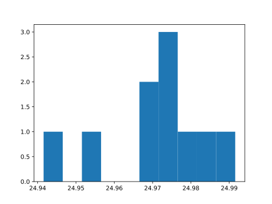
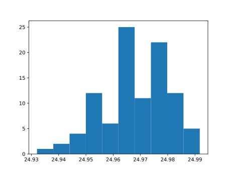
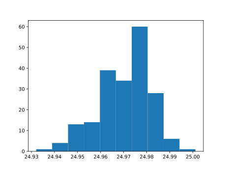
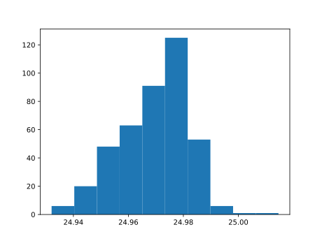
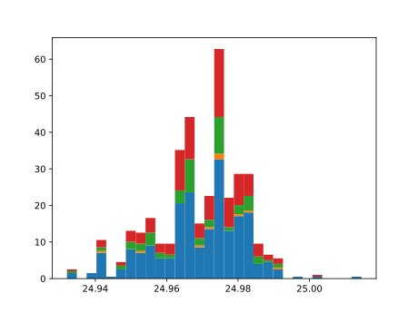

| Attribute  | X1 transaction date | X2 house age | X3 dist to nearest MRT station | X4 no of convenience stores | X5 latitude | X6 longitude | Y house price of unit area |
| --- | ------------------- | ------------ | -------------------------------------- | ------------------------------- | ----------- | ------------ | -------------------------- |
| Mean | 2013.1489533028987 | 17.71256038647343 | 1083.8856889130436 | 4.094202898550725 | 24.969030072463767 | 121.53336108695655 | 37.980193236714975 |
| Median | 2013.1666667 | 16.1 | 492.2313 | 4.0 | 24.9711 | 121.53863 | 38.45
| Mean10 | 2013.1666666600001 | 19.64 | 1086.4608899999998 | 3.0 | 24.971652999999996 | 121.53291699999997 | 35.25 |
| Mean10int | (2012.996256399749, 2013.3370769202513) | (11.854354090555805, 27.425645909444196) | (409.50833033344736, 1763.4134496665522) | (1.5284264831895973, 4.471573516810403) | (24.963116791404023, 24.98018920859597) | (121.52537389926741, 121.54046010073253) | (28.693748309381434, 41.806251690618566) |
| Median10 | 2013.0833333 | 16.3 | 517.5976 | 2.5 | 24.975099999999998 | 121.53582 | 34.25 |
| Median10int | (2012.9129230397489, 2013.2537435602512) | (8.514354090555805, 24.085645909444196) | (-159.35495966655242, 1194.5501596665524) | (1.0284264831895973, 3.9715735168104027) | (24.966563791404024, 24.98363620859597) | (121.52827689926744, 121.54336310073256) | (27.693748309381434, 40.806251690618566)
| Mean100int | (2013.1047243631826, 2013.1952756228177) | (14.323407634935217, 17.94859236506478) | (847.3406652268029, 1303.5933361731968) | (3.55245873954086, 4.50754126045914) | (24.966365715409154, 24.970300684590853) | (121.5310685431361, 121.5365960568639) | (36.658578334741755, 41.59742166525825)
| Median100int | (2013.0380576701825, 2013.1286089298176) | (12.037407634935219, 15.662592365064782) | (238.51171452680302, 694.7643854731969) | (3.52245873954086, 4.47754126045914) | (24.96615751540915, 24.97009248459085) | (121.5377462431361, 121.5432737568639) | (37.98057833474175, 42.919421665258255) |
| Mean200int | (2013.0980656372008, 2013.1661010357998) | (15.815564545456043, 18.44943545454395) | (829.2739973563539, 1080.0892751436459) | (3.8777668274367785, 4.532233172563221) | (24.96883759247301, 24.971437707526984) | (121.53277097755158, 121.53604472244841) | (37.87790048277373, 41.12309951722627) |
| Median200int | (2013.0493156007005, 2013.1173509992996) | (14.333064545456045, 16.96693545454395) | (365.88031110635404, 616.695588893646) | (3.6727668274367784, 4.327233172563221) | (24.97140494247301, 24.974005057526984) | (121.53780812755159, 121.54108187244842) | (37.97740048277373, 41.22259951722627) |
| Mean10boot | 2013.03333332 2013.3000000099996 | 13.469999999999999 26.01 | 572.7600600000001 1716.3693099999996 | 1.8 4.2 | 24.963992 24.978082 | 121.52603199999999 121.53862 | 29.77 40.989999999999995 |
| Med10boot | 2012.9583333 2013.4166667 | 11.5 32.5 | 424.5442 1262.4885 | 1.0 5.0 | 24.97005 24.979535 | 121.5317 121.53913 | 28.0 41.1 | 
| Mean10boot | 2013.03333332 2013.3000000099996 | 13.469999999999999 26.01 | 572.7600600000001 1716.3693099999996 | 1.8 4.2 | 24.963992 24.978082 | 121.52603199999999 121.53862 | 29.77 40.989999999999995
| Mean10boot | 2013.03333332 2013.3000000099996 | 13.469999999999999 26.01 | 572.7600600000001 1716.3693099999996 | 1.8 4.2 | 24.963992 24.978082 | 121.52603199999999 121.53862 | 29.77 40.989999999999995
| Mean100boot | 2013.102499992 2013.1949999910003 | 14.384 17.848 | 859.6043903999998 1303.0191665999998 | 3.52 4.51 | 24.966400200000002 24.9702859 | 121.53104189999998 121.5364213 | 36.833000000000006 41.582 |
| Med100boot | 2013.0833333 2013.1666667 | 12.95 16.25 | 383.78765 545.4771 | 3.0 5.0 | 24.96651 24.97279 | 121.53756 121.540975 | 37.4 42.3 |
| Mean200boot | 2013.0983333355002 2013.1658333394998 | 15.822000000000001 18.436 | 826.7667209500001 1070.2963515 | 3.89 4.54 | 24.96895325 24.97151145 | 121.53293125 121.53595435 | 37.9705 41.176500000000004 |
| Med200boot | 2013.0833333 2013.20833335 | 13.6 16.9 | 441.64115000000004 547.6375499999999 | 4.0 5.0 | 24.9698 24.974040000000002 | 121.537875 121.54065 |37.5 41.1 |

Covariance matrix in the form of a table

| X1 transaction date | X2 house age | X3 dist to nearest MRT station | X4 no of convenience stores | X5 latitude | X6 longitude | Y house price of unit area |
| ------------------- | ------------ | -------------------------------------- | ------------------------------- | ----------- | ------------ | -------------------------- |
| 1.42829167e+04 | -1.63707736e+00 | -4.46152174e+01 | -2.04489936e+03 | -4.46497585e+00 | -1.49760990e-02 | -2.02599638e-02 |
| -1.63707736e+00 | 7.93292839e-02 | 5.62208779e-02 | 2.16154365e+01 | 7.90859345e-03 | 1.22247674e-04 | -1.77293554e-04 |
| -4.46152174e+01 | 5.62208779e-02 | 1.29475205e+02 | 3.67518374e+02 | 1.66016943e+00 | 7.67546286e-03 | -8.46287839e-03 |
| -2.04489936e+03 | 2.16154365e+01 | 3.67518374e+02 | 1.58907300e+06 |-2.23452784e+03 | -9.23553034e+00 | -1.55804911e+01 |
| -4.46497585e+00 | 7.90859345e-03 | 1.66016943e+00 | -2.23452784e+03 | 8.65537702e+00 | 1.61964424e-02 | 2.02529652e-02 |
| -1.49760990e-02 | 1.22247674e-04 | 7.67546286e-03 | -9.23553034e+00 | 1.61964424e-02 | 1.53640967e-04 | 7.84561714e-05 |
| -2.02599638e-02 | -1.77293554e-04 | -8.46287839e-03 | -1.55804911e+01 | 2.02529652e-02 | 7.84561714e-05 | 2.34967099e-04 |

Histograms

